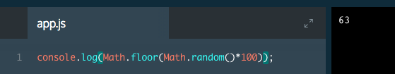
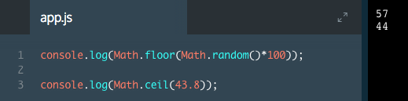
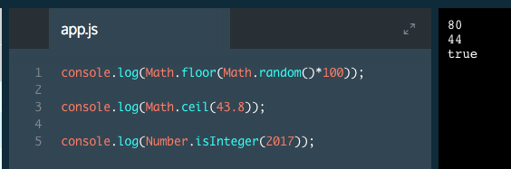

# Libraries

Libraries are collections of methods that can be called without an instance.
Instance methods, by definition, require that you create an instance before you can use them. What if you want to call a method without an instance? That's where JavaScript libraries come in. Libraries contain methods that you can call without creating an instance.

One such collection contains mathematical methods, aptly named the `Math` library.

Let's see how you call the `.random()` method from the `Math` library:

```js
console.log(Math.random()); // random number between 0 and 1
```

In the example above, we called the `.random()` method by appending the library name with a period, the name of the method, and opening (`(`) and closing (`)`) parentheses. This method returns a random number between 0 and 1. This code prints a random number between 0 and 1.

To generate a random number between 0 and 50, we could multiply this result by 50, like so:

```js
Math.random() * 50;
```

The answer in the example above will most likely be a decimal. To ensure the answer is a whole number, JavaScript provides a built-in method called `Math.floor()`. `Math.floor()` takes a decimal number, and rounds down to the nearest whole number. You can use `Math.floor()` to round a random number like this:

```js
Math.floor(Math.random() * 50);
```
In this case:

1. `Math.random` generates a random number between 0 and 1.
2. We then multiply that number by 50, so now we have a number between 0 and 50.
3. Then, `Math.floor` rounds the number down to the nearest whole number.

### Example







Here is JavaScript [Math Library](https://developer.mozilla.org/en-US/docs/Web/JavaScript/Reference/Global_Objects/Math); [Number Library](https://developer.mozilla.org/en-US/docs/Web/JavaScript/Reference/Global_Objects/Number)

