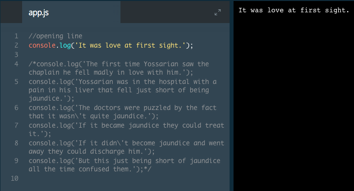

# Comments

As we write JavaScript, we can create comments in our code.

Programs do not evaluate comments when you run them. In other words, they exist just for human readers. Good comments are useful for you and other developers, because they describe what the code does.

There are two types of code comments in JavaScript:

A single line comment will comment out a single line and is denoted with two forward slashes // preceding a line of JavaScript code.

```js
// The first 5 decimals of pi
console.log('Pi is equal to ' + 3.14159);
```
A multi-line comment will comment out multiple lines and is denoted with /* to begin the comment, and */ to end the comment.

```js
/*
console.log('All of this code');
console.log('Is commented out');
console.log('And will not be executed);
*/
```

Single line comments are great for adding context to your code. Multi-line comments are often best suited to prevent a block of code from running. However, both types of comments can be used for either purpose.

### Example

