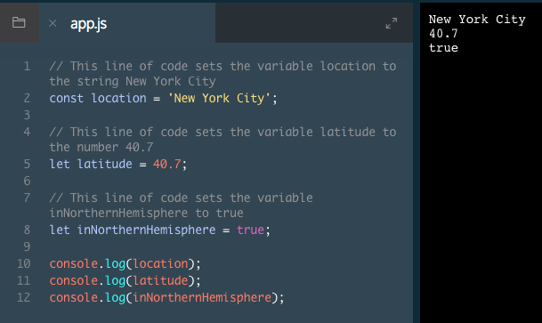

# Variables

Programmers use variables to write code that is easy to understand and repurpose.

Imagine you're writing a weather app. Your thermometer outside reports the temperature in Celsius, but your goal is to record the temperature in Fahrenheit.

You write a program that takes a temperature of 15 degrees Celsius and calculates the temperature in Fahrenheit.

Once you've done this though, you see the temperature now reads 16 degrees Celsius. To find Fahrenheit again, you'd need to write a whole new program to convert 16 degrees Celsius to Fahrenheit.

That's where variables come in. Variables allow us to assign data to a word and use the word to reference the data. If the data changes (like degrees Celsius) we can replace the variable's value instead of re-writing the program.

In this lesson you will learn about two ways to declare variables: `let` and `const`.

