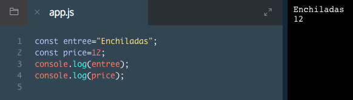

# Create a Variable: const

Let's dive in and see a variable in the wild. Here is how you declare a constant variable:

```js
const myName = 'Arya';
console.log(myName);
// Output: Arya
```
Let's consider the example above:

1. `const`, short for `constant`, is a JavaScript keyword that creates a new variable with a value that cannot change.
2. `myName` is the variable's name. Notice that the word has no spaces, and we capitalized the `N`. Capitalizing in this way is a standard convention in JavaScript called camelCasing, because the capital letters look like the humps on a camel's back.
3. `=` is the assignment operator. It assigns the value `('Arya')` to the variable `(myName)`.
4. `'Arya'` is the value assigned `(=)` to the variable `myName`.

After the variable is declared, we can print `'Arya'` to the console with: `console.log(myName)`.

You can save any data type in a variable. For example, here we save numbers:

```js
const myAge = 11;
console.log(myAge);
// Output: 11
```

In the example above, on line 1 the `myAge` variable is set to 11. Below that, `console.log()` is used to print 11 to the console.

### Example

