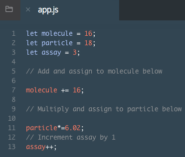

# Mathematical Assignment Operators

In this exercise, let's consider how we can use variables and math operators to calculate new values and assign them to a variable. Check out the example below:

```js
let x = 4;
x = x + 1;
```
In the example above, we created the variable x with the number 4 assigned to it. On the following line, `x = x + 1` increases the value of x from 4 to 5.

Notice, on line two in the example above, to increment `x` by one we had to write the `x` variable on the left and right side of the assignment operator `(=)`. Using a variable twice in one expression is redundant and confusing.

To address this, JavaScript has a collection of built-in mathematical assignment operators that make it easy to calculate a new value and assign it to the same variable without writing the variable twice. See examples of these operators below.

```js
let x = 4;
x += 2; // x equals 6

let y = 4;
y -= 2; // y equals 2

let z = 4;
z *= 2; // z equals 8

let r = 4;
r++; // r equals 5

let t = 4;
t--; // t equals 3
```
In the example above, operators are used to calculate a new value and assign it to the same variable. Let's consider the first three and last two operators separately:

* The first three operators `(+=, -=, and *=)` perform the mathematical operation of the first operator `(+, -, or *)` using the number on the right, then assign the new value to the variable.
* The last two operators are the increment `(++)` and decrement `(--)` operators. These operators are responsible for increasing and decreasing a number variable by one, respectively.

### Example



