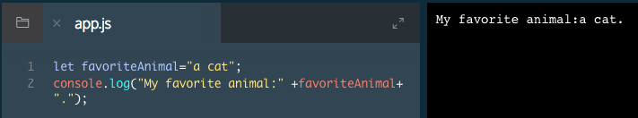

# String Interpolation

In previous exercises, we assigned strings to variables. Here, you will learn how to insert the content saved to a variable into a string.

The JavaScript term for inserting the data saved to a variable into a string is string interpolation.

The `+` operator, known until now as the addition operator, is used to interpolate (insert) a string variable into a string, as follows:

```js
let myPet = 'armadillo';
console.log('I own a pet ' + myPet + '.'); 
// Output: 'I own a pet armadillo.'
```
In the example above, we saved the value `'armadillo'` to the myPet variable. On the second line, the `+` operator is used to combine three strings: `I own a pet`, the value saved to `myPet`, and `.`. We log the result of this interpolation to the console as:

`I own a pet armadillo.`

### Example



# String Interpolation II

In the newest version of JavaScript (ES6) we can insert variables into strings with ease, by doing two things:

Instead of using quotes around the string, use backticks (this key is usually located on the top of your keyboard, left of the 1 key).

Wrap your variable with `${myVariable}`, followed by a sentence. No +s necessary.
ES6 string interpolation is easier than the method you used last exercise. With ES6 interpolation we can insert variables directly into our text.

It looks like this:

```js
let myPet = 'armadillo'
console.log(`I own a pet ${myPet}.`)
// Output: 'I own a pet armadillo.'
```
In the example above, the backticks (`) wrap the entire string. The variable (myPet) is inserted using ${}. The resulting string is:

`I own a pet armadillo.`

### Example


### Project Example

