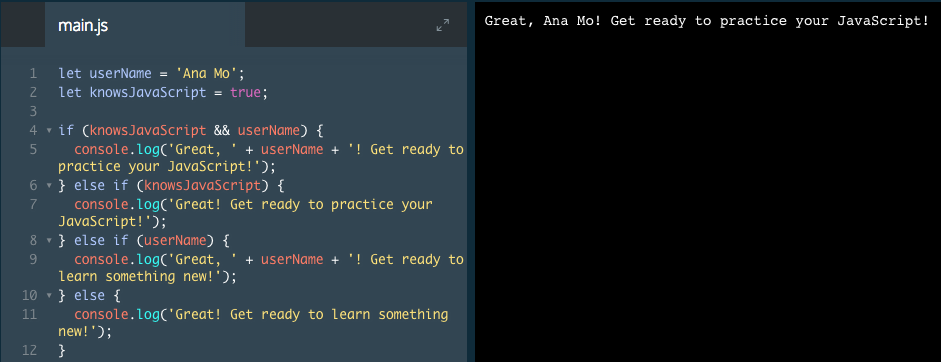

# Introduction to Control Flow

In this lesson, we'll explore how we can use the building blocks of JavaScript to write programs that make decisions.

Control flow statements enable JavaScript programs to make decisions by executing code based on a condition. If a given condition is true, we execute one block of code. If the statement is false, we execute another block of code. For instance, if we were making a game in which the user had to choose which door to enter, we'd need a way for the program to know what to do once the user was in the next room.

### Example

