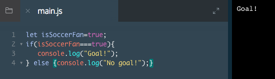

# if/else Statements

The core task of programming is writing lists of instructions for computers, or translating our ideas from human-speak to computer-speak.

Let's learn how we can ask JavaScript to think like us and make decisions the way we do.

We'll start with human-speak. Many decisions we make everyday boil down to this sentence in some form:

"If something is true, let's do option 1, or else, if it is false, let's do option 2."

This sentence looks fairly similar when we write it with JavaScript. See for yourself:

```js
let needsCoffee = true;
if (needsCoffee === true) {
    console.log('Finding coffee');
} else {
    console.log('Keep on keeping on!');
}
```
Lines of code between curly braces are called blocks. `if/else` statements have two code blocks. If the variable `needsCoffee` is `true`, the program will run the first block of code. Otherwise, it will run the other block of code.

`needsCoffee` is the condition we are checking inside the `if's` parentheses. Since it is equal to `true`, our program will run the code between the first opening curly brace `{ (line 2)` and the first closing curly brace `} (line 4)`. It will ignore the else `{ ... }` part. In this case, we'd see Finding coffee log to the console.

If `needsCoffee` were `false`, only the `console.log()` statement in the else block would be executed.

`if/else` statements are how programs can process yes/no questions programmatically.

### Example



