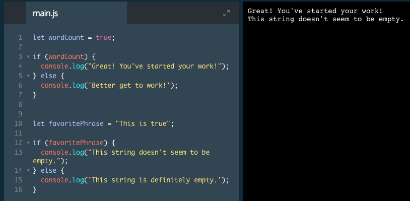
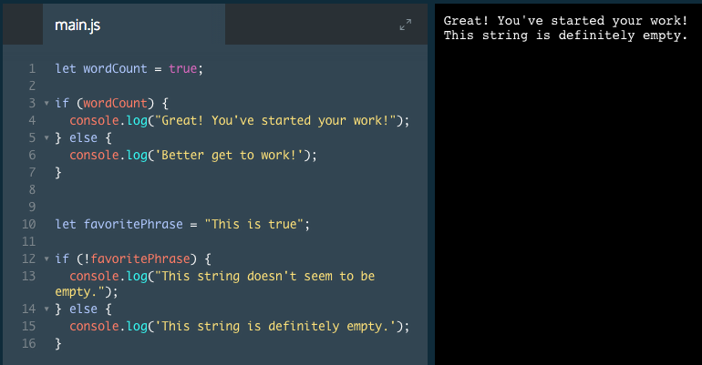

# True and False Values

In the previous exercise, we wrote `if/else` statements. If a given condition were `true`, one block of code would run. If that condition were `false`, a different block of code would run. However, there are data types that are not booleans. Let's explore the concepts of `true` and `false` in variables that contain other data types, including strings and numbers.

In JavaScript, all variables and conditions have a truthy or falsy value.

```js
let variableOne = 'I Exist!';
if (variableOne) {
// This code will run because variableOne contains a truthy value.
} else {
// This code will not run because the first block ran.
}
```
In the first line of the program above, a variable is created and set. The value of this variable is a string rather than a boolean. How does this program determine which code block to run?

The second line of this program checks a condition `if (variableOne)`. In the previous exercise, we checked if a variable was equal to `true` or `false`. By only writing the name of the variable as the condition, we are checking the truthiness of the variableOne. In this case, variableOne contains a truthy value.

If we changed `if (variableOne)` to say `if (variableTwo)`, that condition would evaluate to falsy because we have not created a variable called `variableTwo` in this program. In other words, `variableOne` is truthy and `variableTwo` is falsy.

All variables that have been created and set are truthy (and will evaluate to true if they are the condition of a control flow statement) unless they contain one of the seven values listed below:

* `false`
* `0` and `-0`
* `""` and `''` (empty strings)
* `null`
* `undefined`
* `NaN` (Not a Number)
* `document.all` (something you will rarely encounter)

There is an important distinction between a variable's value and its truthiness: variableOne's value is 'I exist' because that is the data saved to the variable. variableOne is truthy because it exists and does not contain any of the seven falsy values listed above.

### Example



# True and False Values II

In programming, we often evaluate whether or not an expression is true or truthy. Conveniently, JavaScript provides a shorthand notation for this.

```js
let isRaining = true;
if (isRaining) {
   console.log('Carry an umbrella!');
} else {
  console.log('Enjoy the sun!');
}
```
In the example above, the condition is simply `if (isRaining)`. In JavaScript, this is evaluating whether `isRaining` is truthy. If you read the code out loud to yourself, it sounds like a simple sentence: "If it's raining, carry an umbrella. Else, enjoy the sun!"

JavaScript provides an operator for swapping the truthiness and falsiness of values - the exclamation point `(!)`. We can use this in conditional statements as shorthand to check if the value of a variable evaluates to false rather than true.

```js
let isPhoneCharged = true; 
if (!isPhoneCharged) {
  console.log('Plug in your phone!');
} else {
  console.log('No need to charge!');
}
```

In the example above, the program checks if `isPhoneCharged` evaluates to false. Because i`sPhoneCharged` is true, the second block of code will execute.

### Example 

