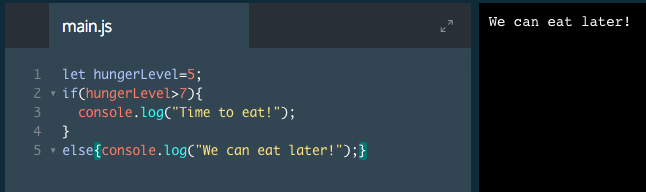

# Comparison Operators

In addition to checking whether a variable evaluates to true or false, sometimes we need to compare variables to other values. We can achieve this with comparison operators.

There are two comparisons you might be familiar with:

* Less than: `<`
* Greater than: `>`

You may also recognize these:

* Less than or equal to: `<=`
* Greater than or equal to: `>=`

These comparisons evaluate to true or false.

### Example

# Comparison Operators II

There are two more useful comparisons we can make. Often, we might want to check if two things are equal to each other or if they are not.

* To check if two things equal each other, we write `===` (three `=` signs in a row).
* To check if two things do not equal each other, we write `!==` (an exclamation with two `=` signs in a row).

It can be confusing when to use one `=` sign and when to use three `===` signs. Use a single `=` to assign a value to a variable. Use `===` to compare the values of two different variables.