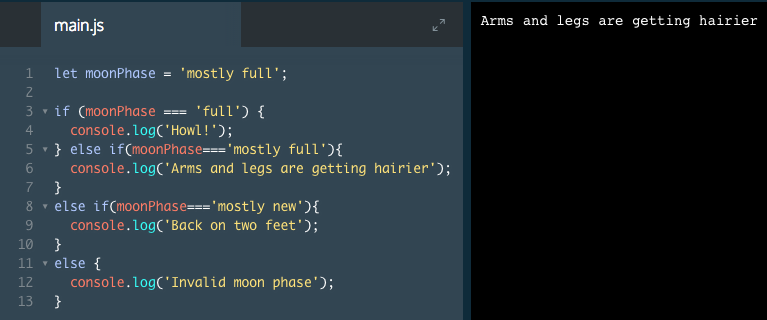

# else if Statements

We've explored `if`/`else` statements that answer questions that are either yes or no. What can we do if we have a question that has multiple yes conditions, or multiple no conditions?

We can add more conditions to our `if`/`else` statement with `else if`. Check out how this fits into our current knowledge of `if`/`else` statements:

```js
let stopLight = 'green';

if (stopLight === 'red') {
  console.log('Stop');
} else if (stopLight === 'yellow') {
  console.log('Slow down');
} else if (stopLight === 'green') {
  console.log('Go!');
} else {
  console.log('Caution, unknown!');
}
```
1. We created a variable named `stopLight` that is assigned to the string green.

2. Then, there's an `if`/`else` statement with multiple conditions, using else if. else if allows us to check multiple values of the `stopLight` variable and output different things based on its color.

3. The block ends with the singular `else` we have seen before. The `else` is a catch-all for any other situation. For instance, if the `stopLight` was blinking blue, the last else would catch it and return a default message.

### Example

