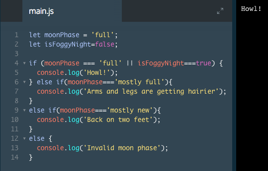

# Logical Operators

We can translate certain thoughts into JavaScript code such as, "Are these things equal?" with `===`, or, "Is one thing greater than another thing?" with `>`.

In English, sometimes we say "both of these things" or "either one of these things." Let's translate those phrases into JavaScript with special operators called logical operators.

To say "both must be true," we use `&&`.
To say "either can be true," we use `||`.

For example:

```js
if (stopLight === 'green' && pedestrians === false) {
  console.log('Go!');
} else {
  console.log('Stop');
}
```

In the example above, we make sure that the `stopLight` is `'green'` and `(&&)` there are `no pedestrians` before we log `Go!`.
If either of those conditions is false, we log `Stop`.

Just like the operators we learned previously, these logical operators will return either true or false.

These logical operators are helpful when writing `if`/`else` statements since they let us make sure multiple variables are `true` or `false`. We can combine these operators with all of the ones we have learned throughout this lesson.

### Example `||`



