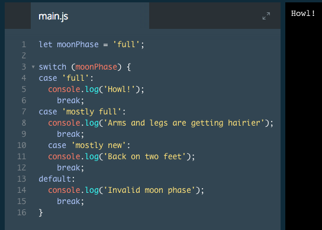

# switch Statements

Before we move on, let's circle back to else if statements.

Using else if is a great tool for when we have a few different conditions we'd like to consider.

`else if` is limited, however. If we want to write a program with 25 different conditions, like a JavaScript cash register, we'd have to write a lot of code, and it can be difficult to read and understand.

To deal with times when you need many `else if` conditions, we can turn to a switch statement to write more concise and readable code.

To a computer, a switch statement and an `if`/`else` statement are the same, but a switch statement can be easier for other humans to read. Part of being a good developer is writing code that both computers and other humans can read.

switch statements look like this:

```js
let groceryItem = 'papaya';

switch (groceryItem) {
  case 'tomato':
    console.log('Tomatoes are $0.49');
    break;
  case 'lime':
    console.log('Limes are $1.49');
    break;
  case 'papaya':
    console.log('Papayas are $1.29');
    break;
  default:
    console.log('Invalid item');
    break;
}
```
1. The switch keyword initiates the statement and is followed by `( ... )`, which contains the condition that each case will compare to. In the example, the condition is groceryItem.
2. Inside the block, `{ ... }`, there are cases. case is like the else if part of an `if`/`else` `if`/`else` statement. The word following the first case is `'tomato'`. If groceryItem equalled `'tomato'`, that case's `console.log()` would run.
3. `groceryItem` equals `'papaya'`, so the first and second case statements are skipped. The third case runs since the case is `'papaya'`, which matches `groceryItem's` value. This particular program will log Papayas are $1.29.
4. Then the program stops with the `break` keyword. This keyword will prevent the switch statement from executing any more of its code. Without adding `break` at the end of each case, the program will execute the code for all matching cases and the default code as well. This behavior is different from `if`/`else` conditional statements which execute only one block of code.
5. At the end of each `switch` statement, there is a `default` condition. If none of the cases are `true`, then this code will run.

### Example



