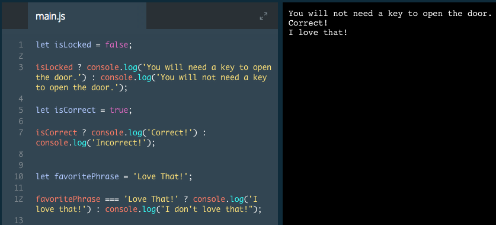

# Ternary Operator

In the previous exercise, we learned shorthand for writing multiple `if`/`else if`/`else` statements to make them easier to read. JavaScript also provides a way to shorten simple `if`/`else` statements called the ternary operator.

```js
let isNightTime = true;

if (isNightTime) {
  console.log('Turn on the lights!');
} else {
  console.log('Turn off the lights!');
}
```
In the example above, we see a very familiar pattern. See the example below for an equivalent way to express this.

`isNightTime ? console.log('Turn on the lights!') : console.log('Turn off the lights!');`

The code in the example above will operate exactly as the code from the previous example. Let's break this example into its parts:

* `isNightTime ?` — the conditional statement followed by a question mark. This checks if `isNightTime` is truthy.
`console.log ('Turn on the lights!')` — this code will be executed if the condition is truthy.
* `:` — a colon separates the two different blocks of code that can be executed.
`console.log('Turn off the lights!');` — this code will be executed if the condition is falsy

In this example, we checked if the value of a variable was `true` or `false`. The ternary operator can be used for any condition that can be evaluated to `true` or `false`, such as those with comparison operators.

```js
age >= 16 ? console.log('You are old enough to drive in the United States!') : console.log('You are not old enough to drive in the United States!');
```

In the example above, the conditional statement is checking whether the value of the variable age is greater than or equal to 16. If so, a message that states the user is old enough to drive will be logged to the console. Otherwise, a message that states the user is not old enough to drive will be logged.

### Example


