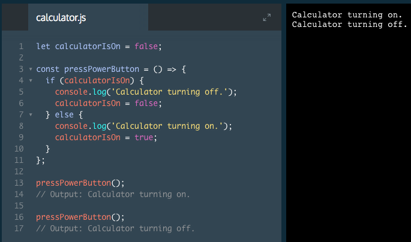
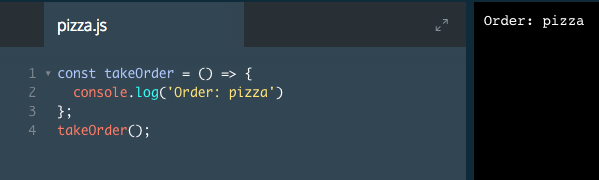
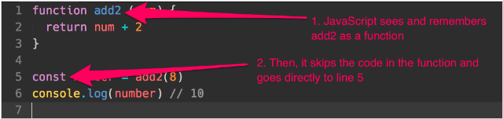
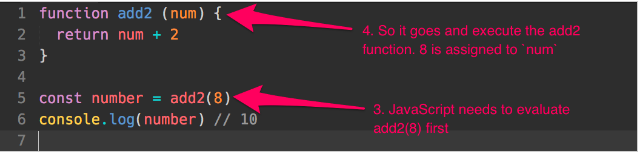
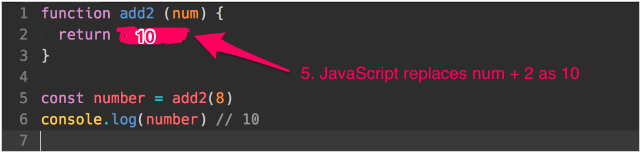
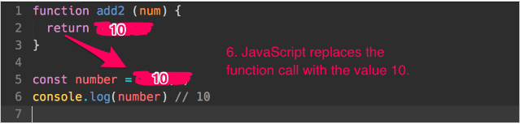

# Introduction to Functions

A function is a block of code designed to perform a task.

Functions are like recipes. They accept data, perform actions on that data, and return a result. The beauty of functions is that they allow us to write a block of code once, then we can reuse it over and over without rewriting the same code.

Take a look at the code in this exercise. This code turns the calculator on if it is currently off, and turns it off if the calculator is currently on.

See if you can figure out how this code works. In the next exercise, we'll walk through it line by line.



## How does this code work?

```js
let calculatorIsOn = false;

const pressPowerButton = () => {
  if (calculatorIsOn) {
    console.log('Calculator turning off.');
    calculatorIsOn = false;
  } else {
    console.log('Calculator turning on.');
    calculatorIsOn = true;
  }
};

pressPowerButton();
// Output: Calculator turning on.

pressPowerButton();
// Output: Calculator turning off.
```

Let's explore each part in detail.

1. We created a function named `pressPowerButton`.

`const pressPowerButton` creates a variable with a given name written in camelCase.

The variable is then set equal `=` to a set of parentheses followed by an arrow token `() =>`, indicating the variable stores a function. This syntax is known as arrow function syntax.

Finally, between the curly braces `{}` is the function body, or the JavaScript statements that define the function. This is followed by a semi-colon `;`. In JavaScript, any code between curly braces is also known as a block.

2. Inside the function body is an `if`/`else` statement. 

3. On the last few lines, we call the function by writing its name followed by a semi-colon `pressPowerButton();`. This executes the function, running all code within the function body. 

4. We executed the code in the function body twice without having to write the same set of instructions twice. Functions can make code reusable!

### Example 2



## Flow of a function

Functions can be hard for beginners to understand. To make sure you understand functions completely, let’s go through what happens when you declare and use a function again. This time, we’ll take things one step at a time.

Here’s the code we’re dissecting:

```js
function add2 (num) {
  return num + 2
}

const number = add2(8)
console.log(number) // 10
```
First of all, you need to declare a function before you can use it. In the first line, JavaScript sees the function keyword and knows the function is called `add2`.

It skips over the code in the function at this point because the function is not used yet.



Next, JavaScript sees you’re declaring a variable called `number`, and assigning it as the result of `add2(8)`.

Since the right hand side (RHS) is a function call (an expression), JavaScript needs to evaluate the value of `add2(8)` before it can assign it to the `number` variable. Here, it sets the parameter `num` to `8`, since you passed in 8 as the argument when you call `add2(8)`.



In the `add2` function, JavaScript sees a return statement that says `num + 2`. This is an expression, so it needs to evaluate it before moving on. Since `num` is `8`, `num + 2` must be `10`.



Once `num + 2` is evaluated, JavaScript returns the value to the function call. It replaces the function call with the returned value. So, `add2(8)` becomes `10`.



Finally, once the RHS is evaluated, JavaScript creates the variable, number and assigns the value 10 to it.

That’s how you read the flow of a function.

