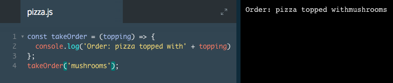
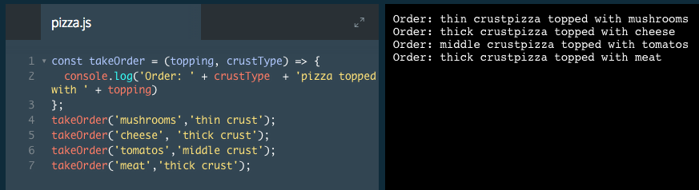

# Parameters

So far our function has not required any input. We can also write functions that accept data. We do this with parameters. Parameters are variables in a function definition that represent data we can input into the function.

```js
const multiplyByThirteen = (inputNumber) => {
  console.log(inputNumber * 13);
};

multiplyByThirteen(9);
// Output: 117
```
Let's explore how this function works:

1. We add `inputNumber` within the parentheses `() =>` of the `multiplyByThirteen` function. `inputNumber` is a parameter.
2. Inside the `multiplyByThirteen()` function, we use `console.log` to print the `inputNumber` multiplied by 13.
3. When we call the `multiplyByThirteen()` function on the last line, we set the `inputNumber` parameter. Here, we set it to 9. Then, inside the function block, 9 is multiplied by 13, resulting in 117 printing to the console.
4. Note on terminology: `inputNumber` is a parameter, but when we call `multiplyByThirteen(9)`, the 9 is called an argument. In other words, arguments are provided when you call a function, and parameters receive arguments as their value. When we set the value 9 as the argument, we pass a value to the function.

Parameters let us write logic inside functions that are modified when we call the function. This makes functions more flexible.

### Example



# Parameters II

If we can set one parameter, can we set two?

We can set as many parameters as we'd like by adding them when we declare the function, separated by commas, like this:

```js
const getAverage = (numberOne, numberTwo) => {
  const average = (numberOne + numberTwo) / 2 ;
  console.log(average);
};

getAverage(365, 27);
// Output: 196
```
The `getAverage()` function has two parameters: `numberOne` and `numberTwo`, both entered in the parentheses `()`.
When we call the `getAverage()` function on the last line, we include two numbers as the arguments, also separated by commas.

In this case, we are telling the function to assign `numberOne` the value of 365 and `numberTwo` the value of 27. We are passing in 365 and 27 to the `getAverage()` function.

When `getAverage()` runs, the function knows what `numberOne` and `numberTwo` equal since we passed in two `arguments` when we called the function. Therefore it evaluates (365 + 27) / 2 and stores the result in the average variable. When logged to the console, the value of the average is 196.

By adding multiple parameters, we can build functions that are more flexible. Now the function has two variables that we can define when we call the function.

### Example



