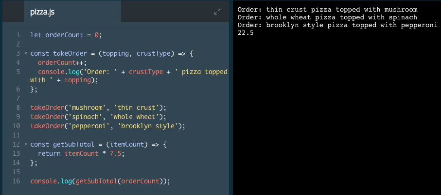
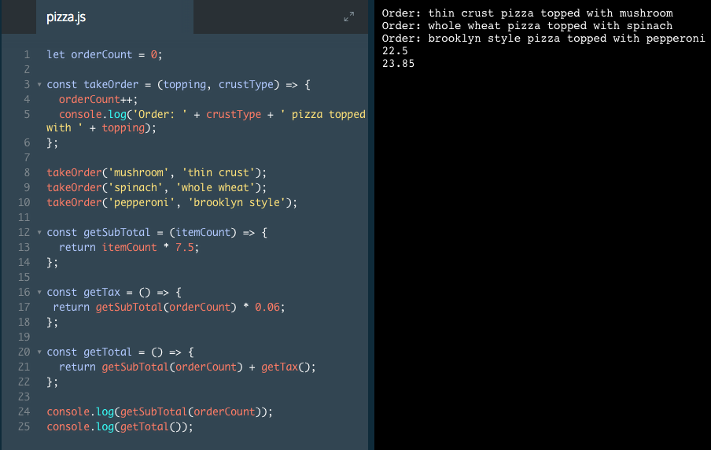

# Return

Using `console.log()` as the result of a function isn't the best use of a function. The purpose of a function is to take some input, perform some task on that input, then return a result.

To return a result, we can use the `return` keyword. Take a look at our function from the last exercise, now re-written slightly:

```js
const getAverage = (numberOne, numberTwo) => {
  const average = (numberOne + numberTwo) / 2;
  return average;
}

console.log(getAverage(365, 27));
// Output: 196
```
1. Instead of using `console.log()` inside the `getAverage()` function, we used the `return` keyword. `return` will take the value of the variable and return it. 

2. On the last line, we called the `getAverage()` function inside of a `console.log()` statement, which outputted the result of 196. 

3. This code achieved the same output as before, however now our code is better. Why? If we wanted to use the `getAverage()` function in another place in our program, we could without printing the result to the console. Using `return` is generally a best practice when writing functions, as it makes your code more maintainable and flexible.

### Example



# Return II

In the last exercise, we pointed out that using return makes programs more maintainable and flexible, but how exactly?

When functions return their value, we can use them together and inside one another. If our calculator needed to have a Celsius to Fahrenheit operation, we could write it with two functions like so:

```js
const multiplyByNineFifths = (celsius) => {
  return celsius * (9/5);
};

const getFahrenheit = (celsius) => {
  return multiplyByNineFifths(celsius) + 32;
};

console.log('The temperature is ' + getFahrenheit(15) + '°F');
// Output: The temperature is 59°F
```
Take a look at the `getFahrenheit()` function. Inside of its block, we called `multiplyByNineFifths()` and passed it the degrees in celsius. The `multiplyByNineFifths()` function multiplied the celsius by (9/5). Then it returned its value so the `getFahrenheit()` function could continue on to add 32 to it.

Finally, on the last line, we interpolated the function call within a console.log() statement. This works because `getFahrenheit()` returns its value.

We can use functions to section off small bits of logic or tasks, then use them when we need to. Writing functions can help take large and difficult problems and break them into small and manageable problems.

### Example



