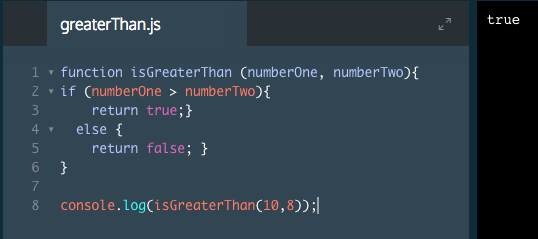

# Function Declarations

Now that we have an understanding of functions in JavaScript, let's take a broader look at the type of functions we'll see. Functions in JavaScript are generally declared as either a *function declaration* or a *function expression*.

A function declaration is a function that is bound to an identifier or name.

```js
function square (number) {
  return number * number; 
}

console.log(square(5));
// Output: 25.
```
Function declarations require the keyword `function`, a name, and a function body. You can identify this by the use of `function square()` and the `{}` below. Function declarations do not end in a semi-colon.

### Example



