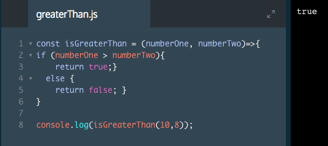

# Function Expressions

A *function expression* is similar to function declaration, with the exception that identifier can be omitted, creating an anonymous function. Function expressions are often stored in a variable. You can identify a function expression by the absence of a function name immediately trailing the function keyword.

```js
const square = function (number) {
  return number * number;
};

console.log(square(5));
// Output: 25.
```
Also note function expressions end with a semi-colon since they are stored in a variable.

In this lesson, we have primarily been using a type of function expression known as an arrow function. Arrow function syntax is a shorter syntax for a function expression. You can identify arrow functions through the use of parentheses and the arrow token `() =>`.

```js
const square = (number) => {
  return number * number;
};

console.log(square(5));
// Output: 25.
```
It's important to be familiar with the multiple ways of writing functions, since you will come across these in JavaScript code.

### Example


