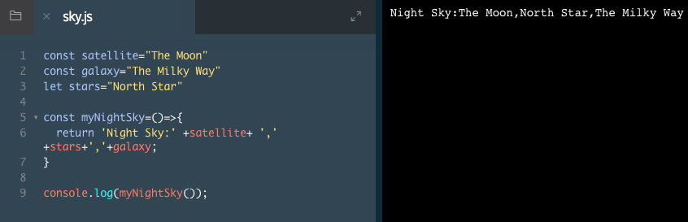
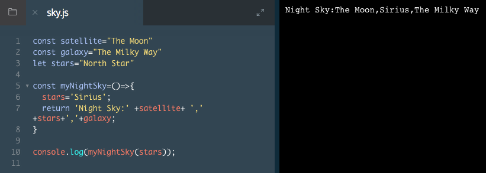

# Global Scope

We'll start with global scope. Variables defined in the global scope are declared outside of a set of curly braces {}, referred to as a block, and are thus available throughout a program. We'll cover more on blocks in subsequent exercises.

Let's take a look at an example of global scope.

```js
const color = 'blue'

const colorOfSky = () => {
  return color; // blue 
};

console.log(colorOfSky()); // blue
```
Here the variable `color` is declared outside of the function block, giving it global scope.
In turn, `color` can be accessed within the `colorOfSky` function.
Global variables make data accessible from any place within a program.

### Example



You'll notice that the `myNightSky()` function is able to access the global variables without any problem since the variables are available *globally*.

# Global Scope II

While it's important to know what global scope is, it's better to avoid defining variables in the global scope. Globally scoped variables can collide with variables that are more locally scoped, causing unexpected behavior in our code.

Let's see what happens if we create a variable that overwrites a global variable.



You'll notice that the global variable `stars` was reassigned to `'Sirius'`. In other words, we unexpectedly changed the value of the global variable, and this could impact our program in ways we do not intend.


