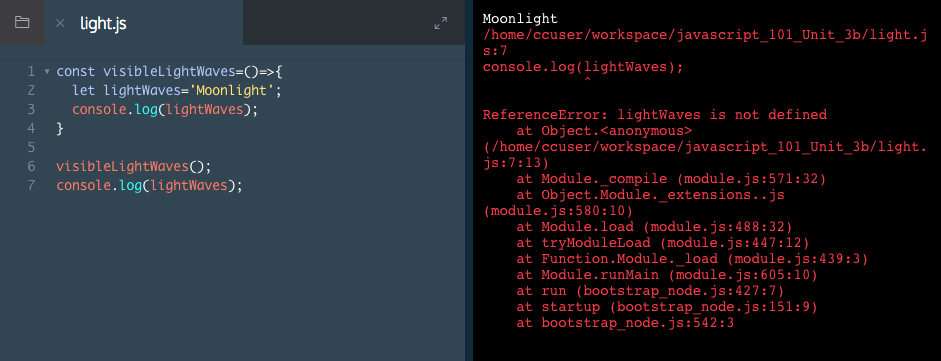

# Block Scope

Because of the challenges with global scope, it is preferable to define variables in block scope.

A block refers to the `{}` braces of a function, a loop, or an `if` statement, and serves as an important structural marker for our code. Block scope means that a variable defined in the block is only accessible within the curly braces.

Block scope works like this:

```js
const colorOfSky = () => {
  let color = 'blue'; 
  console.log(color); // blue 
};

colorOfSky(); // blue 
console.log(color); // undefined
```
You'll notice:

1. We define a function `colorOfSky()`.
2. Within the function, the `color` variable is only available within the curly braces of the function.
3. If we try to log the same variable outside the function, it logs `undefined`.

### Example

We can call a function from outside a function


If we log the value of `lightWaves` to the console from outside the function. You'll notice that it logs a `ReferenceError` since the variable is tied to the block scope of the function!



# Block Scope II

Let's take a look at another example of block scope, as defined within an if block:

```js
const colorOfSky = () => {
  const dusk = true;
  let color = 'blue'; 
  if (dusk) {
    let color = 'pink';
    console.log(color); // pink
  }
  console.log(color); // blue 
};

colorOfSky(); // blue
console.log(color); // undefined
```
Here, you'll notice:

1. We create a variable `dusk` inside the `colorOfSky()` function.
2. After the `if` statement, we define a new code block with the `{}` braces. Here we assign a new value to the variable `color` if the `if` statement is true.
3. Within the `if` block, the `color` variable holds the value `pink`, though outside the `if` block, in the function body, the `color` variable holds the value `blue`.

Block scope is a powerful tool in JavaScript, since it allows us to define variables with precision, and not pollute the global namespace.

### Example


Notice the ouput. Inside the `if` block `console.log(lightWaves)` logs the value `Northern Lights` to the console. Outside the `if` block, but still within the function, the same statement logs `Moonlight` to the console.

# Block Scope III

Let's take a look at one other common example of block scope, as defined within a for loop.

```js
const cloudCount = () => {
  let i = 2;
  console.log(i); // 2
  for (let i = 0; i < 10; i++) {
    console.log(i); // All numbers from 0 to 9
  }
};

cloudCount();
console.log(i); // undefined
```
1. Here the variable `i` is defined in the `cloudCount()` function.
2. Within the `for` loop block, we again define `i`, as a value that will be incremented.
3. The local value of `i`, whether defined in the function block or the `for` loop, has no impact on the global scope of our program.

### Example

We can call `starCount()` function, from outside of the function.


We can't log the value of `i` to the console from outside of the function. It returns a Reference Error! The value of `i` is contained in the block scope.


