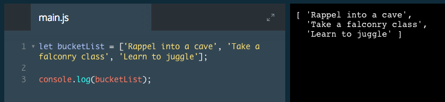

# Arrays

A foundational concept of programming is how to organize and store data.

One way we organize data in real life is to make lists. Let's make one here:

New Year's Resolutions:
1. Rappel into a cave
2. Take a falconry class
3. Learn to juggle

Let's now write this list in JavaScript, as an array:

```js
let newYearsResolutions = ['Rappel into a cave', 'Take a falconry class', 'Learn to juggle'];
```
Arrays are JavaScript's way of making lists. These lists can store any data types (including strings, numbers, and booleans) and they are ordered, meaning each item has a numbered position.



