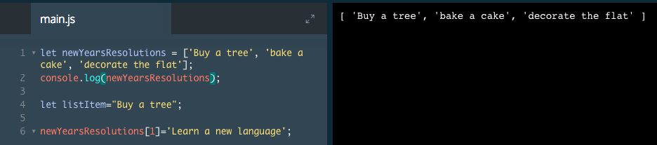

# Update Elements

In the previous exercise, you learned how to access elements of an array or a string using their index number. You can also change elements of an array using their indices.

```js
let seasons = ["Winter", "Spring", "Summer", "Fall"];

seasons[3] = "Autumn";
console.log(seasons) 
//Output: 
//Winter 
//Spring
//Summer
//Autumn
```
In the example above, the seasons array contained the names of the four seasons.

However, we decided that we preferred to say "Autumn" instead of "Fall".

`seasons[3] = "Autumn";` tells our program to change the item at `index 3` of the seasons array to be "Autumn" instead of what is already there.

### Example



