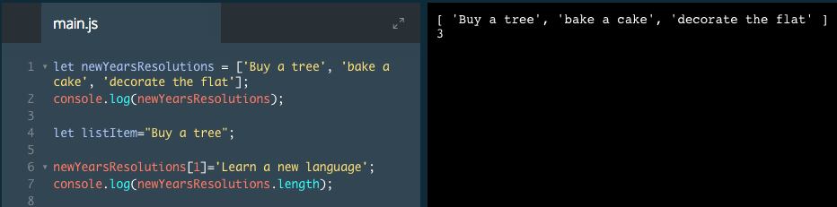

# length property

We may wish to know how many items are stored inside of an array.

We can find this out by using one of an array's built-in properties, called `length`. We can attach this to any variable holding an array and it will return the number of items inside.

```js
let newYearsResolutions = ['Rappel into a cave', 'Take a falconry class'];

console.log(newYearsResolutions.length);
// Output: 2
```
In the example above, we log `newYearsResolutions.length` to the console. This code retrieves the `length` property of the `newYearsResolutions` array and logs it to the console. This array has two items, so `2` would be logged to the console.



