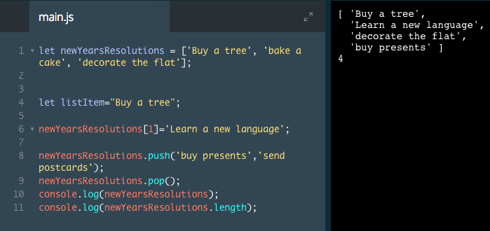
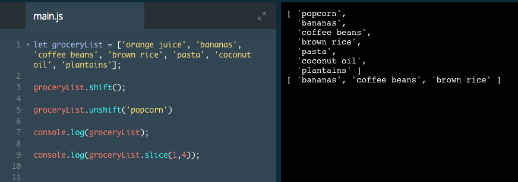

# push Method, pop Method

JavaScript has built in methods for arrays that help us do common tasks. Let's learn some of them.

First, `.push()` allows us to add items to the end of an array. Here is an example of how this is used:

```js
let newYearsResolutions = ['item 0', 'item 1', 'item 2'];

newYearsResolutions.push('item 3', 'item 4');
The method .push() would make the newYearsResolutions array look like:

['item 0', 'item 1', 'item 2', 'item 3', 'item 4'];
```
How does `.push()` work?

1. It connects to `newYearsResolutions` with a period.
2. Then we call it like a function. That's because `.push()` `*is* a function and one that JavaScript allows us to use right on an array.

Another array method, `.pop()`, is similar to `.push()`. This method removes the last item of an array.

```js
let newYearsResolutions = ['item 0', 'item 1', 'item 2'];

newYearsResolutions.pop();

console.log(newYearsResolutions); 
// Output: [ 'item 0', 'item 1' ]
```
In the example above, calling `.pop()` on the `newYearsResolutions` array removed item `2` from the end.

### Example



# More Array methods
You can read about all of the array methods that exist on the [Mozilla Developer Network (MDN)](https://developer.mozilla.org/en-US/docs/Web/JavaScript/Reference/Global_Objects/Array) documentation.

`.pop()` and `.push()` modify the array on which they're called. However, there are some array methods that don't modify the array. Be sure to check MDN to understand the behavior of the method you are using.

Some methods that JavaScript developers use frequently are `.join()`, `.slice()`, `.splice()`, `.shift()`, `.unshift()`, and `.concat()` amongst many others.

Below, we will explore some methods that we have not learned yet. We will use these methods to edit a grocery list. As you complete the steps, you can consult the MDN documentation to learn what each method does!`

### Example



