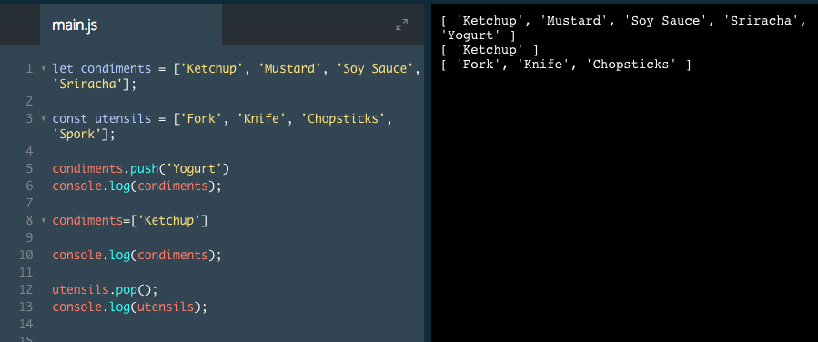

# Arrays with let and const

You may recall that you can declare variables with both the let and const keywords. Variables declared with let can be reassigned.

Variables that are assigned with const cannot be reassigned. However, arrays that are declared with const remain mutable, or changeable.

This means that we can change the contents of an array, but cannot reassign the variable name to a new array or other data type.

The example below will illustrate this more clearly. Pay close attention to the similiarities and differences between the `condiments` array and the `utensils` array as you complete the steps.

# Review Arrays

We learned these concepts regarding arrays:

* Arrays are lists and are a way to store data in JavaScript.
* Arrays are created with brackets `[]`.
* Each item inside of an array is at a numbered position, starting at `0`.
* We can access one item in an array using its numbered position, with syntax like: `myArray[0]`.
* We can also change an item in an array using its numbered position, with syntax like `myArray[0] = "new string"`;
* Arrays have a length property, which allows you to see how many items are in an array.
* Arrays have their own methods, including `.push()` and `.pop()`, which add and remove items from an array, respectively.
* Arrays have many other methods that perform different functions, such as `.slice()` and `.shift()`. You can read the documentation for any array method on the Mozilla Developer Network website.
* Variables that contain arrays can be declared with `let` or `const`. Even when declared with `const`, arrays are still mutable; they can be changed. However, a **variable declared with const cannot be reassigned**.

