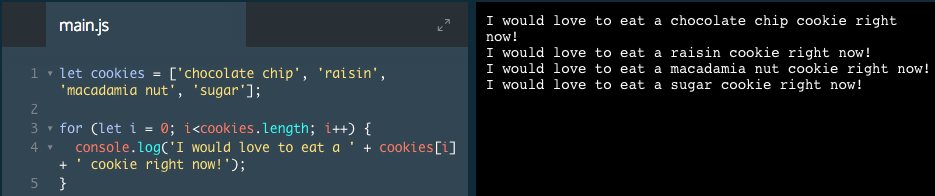
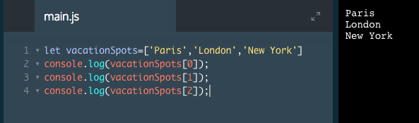

# Loops

One of a computer's greatest abilities is to repeat a task multiple times. Loops let us tell the computer to loop over a block of code so that we don't have to write out the same process over and over.

Loops are especially useful when we have an array where we'd like to do something to each of its items, like logging each item to the console.

There are two kinds of loops we will learn in this lesson:

1. `for` loops, which let us loop a block of code a known amount of times.

2. `while` loops, which let us loop a block of code an unknown amount of times.

### Example

If we console.log each item form the array mannyally we'll have

But imagine if our  list had 100 items on it. Logging each item to the console by hand would be an extremely tedious task!

To make this more efficient it's better to use a loop.

