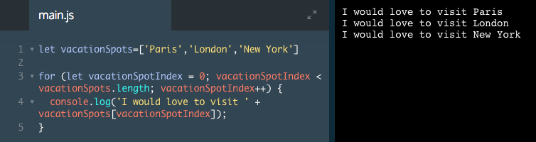
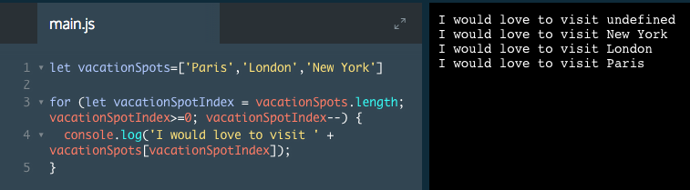
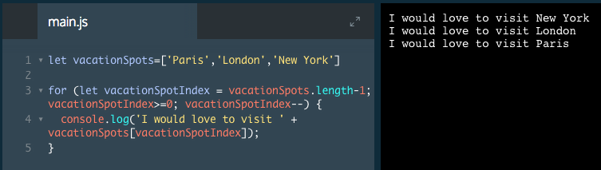

# for Loops

Instead of writing out the same code over and over, let’s make the computer loop through our array for us. We can do this with for loops.

The syntax looks like this:

```js
let animals = ["Grizzly Bear", "Sloth", "Sea Lion"];

for (let animalIndex = 0; animalIndex < animals.length; animalIndex++) {
  console.log(animals[animalIndex]);
}
```
The output would be the following:

```
Grizzly Bear
Sloth
Sea Lion
```
Since this syntax is a little complicated, let's break it into four parts:

1. Within the `for` loop's parentheses, the *start condition* is let `animalIndex = 0`, which means the loop will start counting at `0`. `animalIndex` is called an *iterator variable* and it is a good practice to give this variable a descriptive name.
2. The *stop condition* is `animalIndex < animals.length`, which means the loop will run as long as `animalIndex` is less than the `length` of the `animals array`. When `animalIndex` is equal to the `length` of the `animals array`, the loop will stop executing.
3. The *iterator* is `animalIndex++`. This means that after each loop, `animalIndex` will increase by 1.
4. Finally, the code block is inside of the `{ and }` curly braces. The block will execute each loop until the program reaches the stop condition.

The secret to loops is that `animalIndex`, the variable we created inside the for loop's parentheses, is equal to a number. To be more clear, the first loop, `animalIndex` will equal `0`, the second loop, `animalIndex` will equal `1`, and the third loop, `animalIndex` will equal `2`.

Loops make it possible to write `animals[0]`, `animals[1]`, `animals[2]` programmatically instead of by hand. We can write a for loop and replace the hard-coded number with the variable `animalIndex`, like this: `animals[animalIndex]`.

### Example



# for Loops, Backwards

If we can make a for loop run forwards through an array, can we make it run backward through one? Of course!
We can make our loop run backward by modifying the start, stop, and iterator conditions.

To do this, we'll need to edit the code between the for loop's parentheses:

1. The start condition should set vacationSpotIndex to the length of the array.
2. The loop should stop running when vacationSpotIndex is less than 0.
3. The iterator should subtract 1 each time, which is the purpose of vacationSpotIndex--.

### Example

1. We need to make three changes to our for loop:

* Edit the start condition to set v`acationSpotIndex` equal to the length of the `vacationSpots` array.
* Then, set the stop condition to when `vacationSpotIndex` is greater than or equal to `0`.
* Finally, change `vacationSpotIndex++` to `vacationSpotIndex--` to subtract `1` from the iterator variable each loop.



2. Except we printed *I would love to visit undefined* .

This happened because the length of `vacationSpots` is `3` so the loop attempted to print `vacationSpots[3]` which does not exist.
Because arrays start counting at `0`, the start condition needs to be the length of the `vacationSpots` array `minus 1`.



