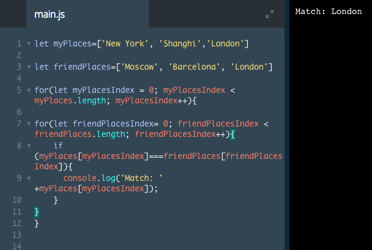

# Nested for Loops

Let's say that you and a friend would like to go on vacation together. You've both made arrays of your favorite places and you want to compare to see if any of them match. This is a job for loops!

The big idea is that we can run a `for` loop inside another `for` loop to compare the items in two arrays.

Every time the outer `for` loop runs once, the inner `for` loop will run completely.

These are called *nested* `for` loops and we can use them to check to see if any of your vacation spots match your friend's spots.

See the example below `for` proper formatting of nested `for` loops.


```js
for (let i = 0; i < myArray.length; i++) {
  for (let j = 0; j < yourArray.length; j++) {
    //Code To Run
   }
 }
 ```
Note that in the example above, we used `i` and `j` as the iterator variables to make the structure of the code easier to see, but it is a better practice to use descriptive variable names.

### Example 

The purpose of the program is to see what you and your friend have in common. Let's utilize the `===` comparison with an `if` statement.

Inside the second `for` loop's block, write an `if` statement that checks if `myPlaces[myPlacesIndex]` is equal to `friendPlaces[friendPlacesIndex]`. If it is, log to the console the place you have in common.



