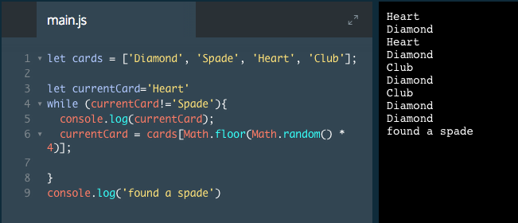

# while Loops

Awesome job! `for` loops are great, but they have a limitation: you have to know how many times you want the loop to run. What if you want a loop to execute an unknown or variable number of times instead?

For example, if we have a deck of cards and we want to flip cards (loop a card flipping function) until we get a Spade, how could we write that in JavaScript?

That's the purpose of the `while` loop. It looks similar to a `for` loop. See the example below.

```js
while (condition) {
  // Code block that loops until condition is false
}
```
The loop begins with the keyword while.
Inside the parentheses, we write a condition. As long as the condition evaluates to `true`, the block of code will loop.
Inside the code block, we can write any code we'd like to loop.

### Example

