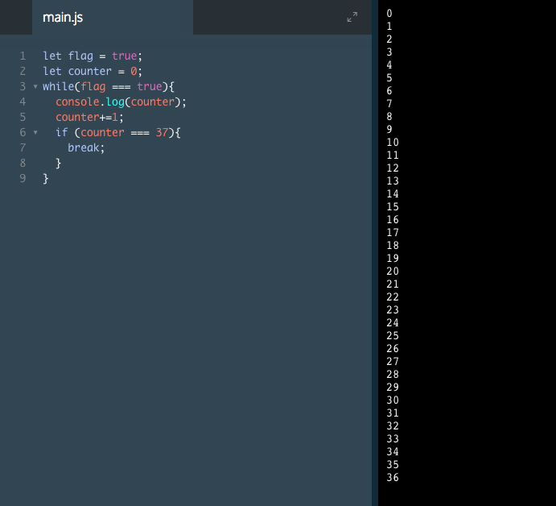

# Infinite Loops

All loops should execute a finite number of times, infinite loops don't reach a stopping point. An infinite loop means there was an error in the logic of the loop because the stopping condition is never reached.

This type of error is harder to spot because your syntax is correct and your code will execute. When an infinite loop occurs, it can freeze your computer, making your computer unresponsive to your commands.

When you initially work with loops, you may accidentally create infinite loops. It is important to be aware of infinite loops so you can avoid them.

Both `for` loops and `while` loops need explicit instructions on when to terminate. Infinite loops are more common in while loops because they don't have an iterator built into their syntax.

When writing a `while` loop, be sure to write code that will guarantee the condition will eventually be met.

A common infinite loop occurs when the condition of the `while statement` is set to `true`. Below is an example of code that will run forever.

```js
// Initiate an infinite loop
while (true) {
    // execute code forever
}
```
`for` loops require a `start condition`, a `stop condition`, and an `iterator`. The `iterator` should bring the loop from the start condition to the stop condition.

```js
for (let i = 0; i < array.length; i--) {
   //some code
}
```
The loop begins with `i` = `0`.
After one iteration through the loop, `i` is equal to `-1`. This is because `i` begins at `0` and `1` is subtracted from `i` each loop.
Do you see the problem? `i` is decreasing each time. It will never equal the length of the array. This code will execute forever.

When we change the iterator to `i++`, as in the example below, `i` will eventually equal the length of the array. We have eliminated the infinite loop!

```js
for (let i = 0; i < array.length; i++) {
   //some code
}
```

To avoid infinite loops, make sure to properly initialize the counter and make sure the terminating condition is eventually met with the proper updates to the counter variable.

### Example



The part of this code that ensures the loop is not infinite is:

```js 
if (counter ===37){
  break;
}
```
This code will terminate the `while` loop, with the `break` keyword, when the condition `counter === 37` is met. Without this code the `while` loop would run infinitely because there is no condition stated to "break" the loop.


