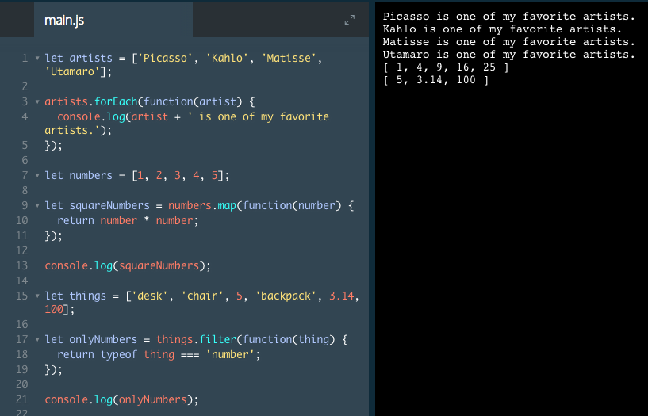

# Introduction to Iterators

One of the most common tasks a developer translates into code is looping over the contents of an array. Programmers often accomplish this with a `for` loop. However, as is often the case when a task occurs frequently, JavaScript now provides methods that simplify this task.

These methods, called *iterators*, are called on arrays and complete such tasks as altering each element and selecting elements that fit certain criteria. In this lesson, you will learn the syntax for these methods, their return values, how to use the documentation to understand them, and how to choose the right iterator method for a given task.

### Example

