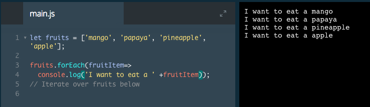

# .forEach()

The first iterator method that we're going to learn is `.forEach()`. Aptly named, `.forEach()` will execute the same code on each element of an array.

```js
let groceries = ['whole wheat flour', 'brown sugar', 'salt', 'cranberries', 'walnuts']; 

groceries.forEach(function(groceryItem) {
  console.log(' - ' + groceryItem);
});
```
The code above will log a nicely formatted list of the groceries to the console. Let's explore each bit of syntax.

1. The first line is an array of grocery items.
2. `groceries.forEach` calls the `.forEach()` method on the groceries array.
3. `(function(groceryItem) {` creates a function that takes a single parameter, `groceryItem` and opens the block of code for that function. Because `.forEach()` is an iterator method, every element in the groceries array will be passed to this function as an argument in place of `groceryItem`. Syntactically, the name of the parameter does not matter. However, it is a best practice to give parameters descriptive names so that other developers who read your code can easily understand what it does.
4. `console.log(' - ' + groceryItem);` is the code we wish to execute upon each element in the array. Logging the item to the console with a `-` in front of it makes the elements look like a list as they're printed out.
5. `});` closes the function code block and `.forEach()` method in that order.

We can simplify this code using arrow function syntax.

```js
groceries.forEach(groceryItem => console.log(' - ' + groceryItem));
```
Both of these examples execute precisely the same process.

There are three important things to know about the `.forEach()` method.

1. It is an array method. It must be called upon an array.
2. Any changes to the iterated array value won't be updated in the original array.
3. The return value is undefined.

### Example



