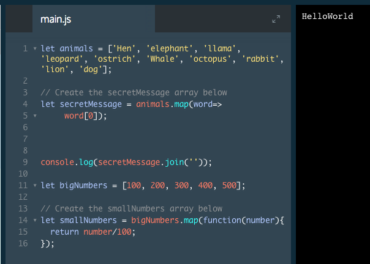

# .map()

In the previous exercise, we called the `.forEach()` method and learned that it returns undefined. It also does not change the array it is called upon. What if we do want to change the contents of the array? We can use `.map()`!

```js
let numbers = [1, 2, 3, 4, 5]; 

let bigNumbers = numbers.map(function(number) {
  return number * 10;
});
```
1. The first line is an array of numbers.
2. `let bigNumbers = numbers.map` creates a new array, `bigNumbers`, in which the returned values of the `.map()` method will be saved and calls the `.map()` method on the numbers array.
3. `(function(number) {` creates a function that takes a single parameter, number, and opens the block of code for that function.
4. `return number * 10`; is the code we wish to execute upon each element in the array. This will save each value from the numbers array, multiplied by `10`, to the `bigNumbers` array.
5. `});` closes the function code block and `.map()` method in that order.

The syntax for `.map()` is almost the same as the syntax for `.forEach()`, with one important change. 

**Notice** that directly before the function call, the code reads, `let bigNumbers =`. This is because `.map(`) returns a new array with elements that have been modified by the code in its block. `bigNumbers` is the new array in which the method will save the values.

`.map()` can also be written with arrow function syntax.

```js
let numbers = [1, 2, 3, 4, 5]; 
let bigNumbers = numbers.map(numbers => numbers * 10);
```

### Example


