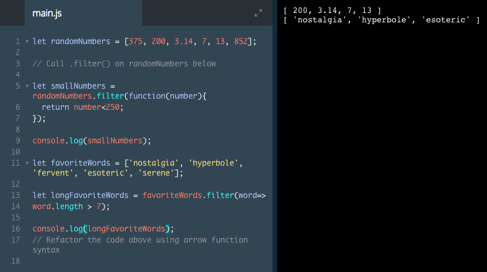

# .filter()

Another useful iterator method is `.filter()`. Like `.map()`, `.filter()` returns a new array. However, `.filter()` returns certain elements from the original array that evaluate to truthy based on conditions written in the block of the method.

```js
let words = ['chair', 'music', 'pillow', 'brick', 'pen', 'door']; 

let shortWords = words.filter(function(word) {
  return word.length < 6;
});
```

1. On the first line, an array is created.
2. `let shortWords =` declares a new array that will contain the returned elements of the `.filter()` method.
3. `words.filter(function(word) {` calls the `.filter()` method on the words array and creates a function that will take a single parameter, word. Each element in the words array will be passed to this function as an argument.
4. `return word.length < 6;` is the condition to filter for all elements in the words array that have fewer than `6` characters will be added to the `shortWords` array.
5. `});` closes the code block and `.filter()` method in that order.

`.filter()` can also be written using arrow function syntax.

```js 
let shortWords = words.filter(word => word.length < 6);
```
### Example

