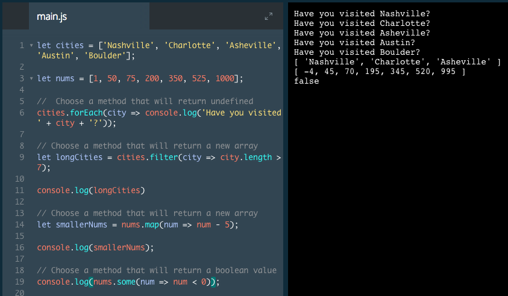

# Choose the Right Iterator

1. To use a method that will do something to each of the values in the array and return undefined, we choose: `.forEach`

2. To use a method that will return a new array with only those elements longer than 7 characters, we choose: `.filter`

3. To use a method that will return a new array of numbers returned from the function, we choose: `.map`

4. To use a method that will return a boolean value, we choose: `.some`

