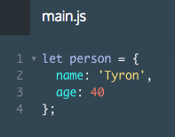

# Introduction to JavaScript Objects

By the end of this lesson, you'll have the knowledge and skills to produce your own JavaScript objects.

Throughout this lesson, you will learn how to:

Represent real-world objects in JavaScript
Access object properties
Access object methods
Create object getter and setter methods
These concepts will enable you to bundle related data and methods into one package that models the real world.

# Objects

JavaScript *objects* are containers that can store data and functions. The data we store in an object is not ordered — we can only access it by calling its associated *key*.

You can create an object with *key-value* pairs using the following syntax:

```js
let restaurant = {
  name: 'Italian Bistro',
  seatingCapacity: 120,
  hasDineInSpecial: true,
  entrees: ['Penne alla Bolognese', 'Chicken Cacciatore', 'Linguine Pesto']
};
```
Let's consider the above example one step at a time:

1. `let restaurant` creates a variable named restaurant that stores the object.
2. We create the object between curly braces: `{}`.
3. `name`, `seatingCapacity`, `hasDineInSpecial`, and `entrees` are all keys.
4. We separate each key from its corresponding value by a colon `(:)`.
5. The `value` is to the right of the colon. For example, `seatingCapacity's` value is `120`.
6. Every `key-value` pair is separated by a comma `,`.

An objects keys point to values that can be any data type, including other objects.



