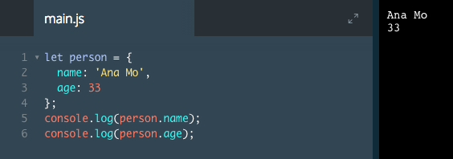
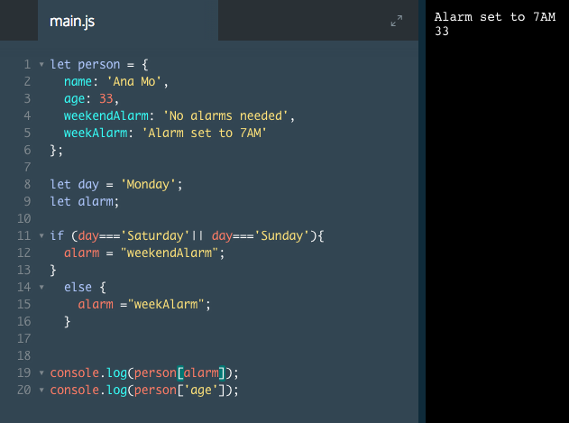

# Accessing Object Properties I

Now that we have data in an object, we need a way to access the values. The most common way to access a key's value is to use *dot notation*.

Look at how entrees is accessed from the restaurant object in last line of the example below:

```js
let restaurant = {
  name: 'Italian Bistro',
  seatingCapacity: 120,
  hasDineInSpecial: true,
  entrees: ['Penne alla Bolognese', 'Chicken Cacciatore', 'Linguine pesto']
};

console.log(restaurant.entrees);
```
The output would be:

`['Penne alla Bolognese', 'Chicken Cacciatore', 'Linguine pesto']`

To access the properties within an object, we connect the value's name to the key name with a period `.`. By using `console.log()` to print `restaurant.entrees`, we can see the `value` of the key `entrees`.



# Accessing Object Properties II

Another way to access a key's value is with *bracket notation*.

Just like with dot notation, we can use opening `([)` and closing `(])` brackets to access a key. The syntax looks like this:

```js
let restaurant = {
  name: 'Italian Bistro',
  seatingCapacity: 120,
  hasDineInSpecial: true,
  entrees: ['Penne alla Bolognese', 'Chicken Cacciatore', 'Linguine pesto']
};

console.log(restaurant['entrees']);
```
The output would, again, be:

`['Penne alla Bolognese', 'Chicken Cacciatore', 'Linguine pesto']`

On the last line of the program, we used `restaurant['entrees']`. This syntax uses bracket notation to select the value at the entrees key from within the restaurant object.

**Notice** that *bracket notation* outputs the same value as *dot notation*. You may see either of these techniques used in JavaScript programs, so it's good to be familiar with both.

# Accessing Object Properties III

One advantage that bracket notation has over dot notation is that you can use variables inside the brackets to select the keys of an object.

For example, a restaurant may have different specials based on the time of day. We could put each special in the `restaurantSpecials` object, then select the one we need later in our program based on the current time.

```js
let meal = 'none';
let time = 12;
// We'll use military time for this example, counting hours 0-23.

const restaurantSpecials = {
 breakfast: 'The breakfast special is 20% off freshly squeezed orange juice',
 lunch: 'The lunch special is 10% off appetizers',
 none: 'There are no specials currently'
};

if (time < 11) { // 11 am
  meal = 'breakfast';
} else if (time < 17) { // 5 pm
  meal = 'lunch';
}

console.log(restaurantSpecials[meal]);

```
The output would be:

`The lunch special is 10% off appetizers`

1. The `restaurantSpecials` object has three key-value pairs for different specials throughout the day: breakfast, lunch, and none.
2. The `if`/`else` statement sets the meal variable to `'breakfast'` or `'lunch'` based on the the time. For purposes of this example, we can imagine the time variable getting updated every hour.
3. On the last line, we wrote `restaurantSpecials[meal]`. The `meal` variable is not a key in the `restaurantSpecials` object. Because we are using bracket notation, JavaScript looks at the meal variable's value. In this case, `meal` is set to 'lunch' within the `if`/`else` statement because time is equal to 12. Since special equals 'lunch', writing `restaurantSpecials[meal]` is the same as writing `restaurantSpecials['lunch']` — the code outputs the lunch special.

Bracket notation is required to use variables to look up keys within an object. It's not possible to use variables like this with dot notation.

### Example


