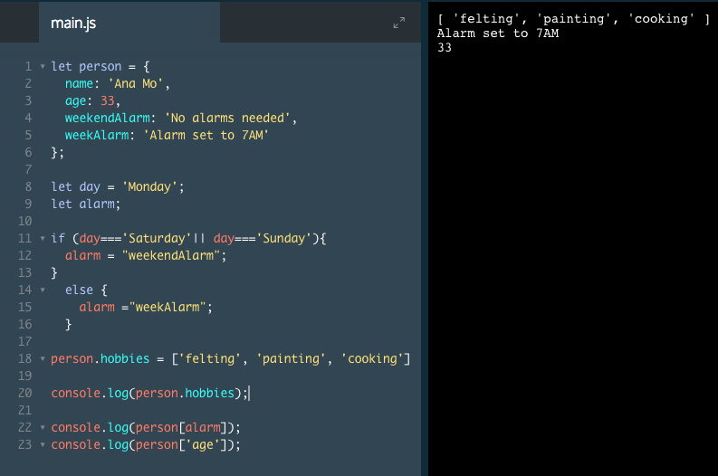

# Adding a Property

What if we want to add an item to our object after we've created it?

We can do this by assigning a value to a new key that's attached to our object. We attach a new key to our object using dot or bracket notation.

Objects are considered *mutable*, which means you can change them after they're created. Even if you save an object to a `const` variable, you can still add to and edit the `key-value` pairs inside of it without causing an error.

As an example, if we have this object:

```js
const restaurant = {
  name: 'Italian Bistro',
  seatingCapacity: 120,
  hasDineInSpecial: true,
  entrees: ['Penne alla Bolognese', 'Chicken Cacciatore', 'Linguine pesto']
}
```
We can add appetizers and desserts keys by writing:

```js
restaurant['appetizers'] = ['Fried Calamari', 'Bruschetta'];
restaurant.desserts = ['Homemade Tiramisu', 'Cannoli'];
```
Since `appetizers` and `desserts` don't exist in the restaurant object, these lines will create and add the key-value pairs.

### Example

We add a 'hobbies' array to the object 



