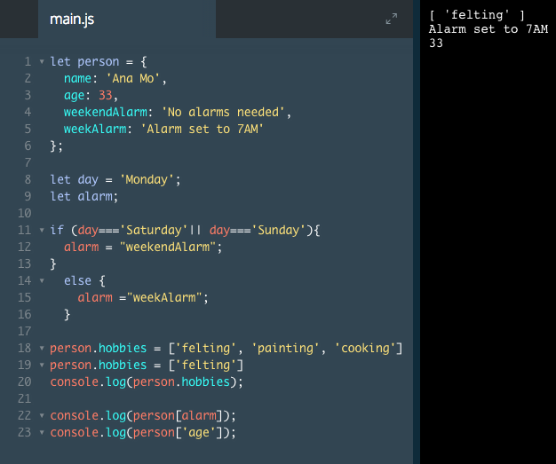

# Editing a Property

In the same way that we added a property to an object, we can modify a key's value.

In the last exercise, we added two properties to the `restaurant` object (`appetizers` and `desserts`).

We can replace the values assigned to `appetizers` and `desserts` with new arrays like this:

```js
restaurant['appetizers'] = ['Fried Calamari', 'Bruschetta', 'Caprese Salad'];
restaurant.desserts = ['Homemade Tiramisu', 'Canolli', 'Cheesecake'];
```
We used bracket and dot notations to specify which keys we wanted to select. Then we set its value to a new array, this time with one more array item inside it.

### Example



