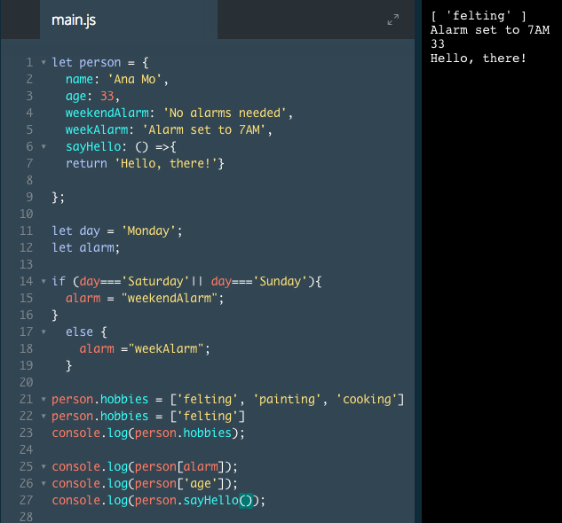

# Methods

So far, we've paired keys with strings, numbers, booleans, and arrays. In this exercise, we'll show you how to pair keys with functions.

When objects have `key-function pairs`, we call the function a `method`. It looks like this:

```js
const restaurant = {
  name: 'Italian Bistro',
  seatingCapacity: 120,
  hasDineInSpecial: true,
  entrees: ['Penne alla Bolognese', 'Chicken Cacciatore', 'Linguine pesto'],
  openRestaurant: () => {
    return 'Unlock the door, flip the open sign. We are open for business!';
  },
  closeRestaurant: () => {
    return 'Lock the door, flip the open sign. We are closed.'
  }
};

console.log(restaurant.openRestaurant());

console.log(restaurant.closeRestaurant());
```
In the example above, we use arrow syntax to create two methods, `.openRestaurant()` and `.closeRestaurant()` in the restaurant object. When we call these methods they return text, which we log to the console. The text in the console appears as follows:

`Unlock the door, flip the open sign. We are open for business!`
`Lock the door, flip the open sign. We are closed.`

### Example



