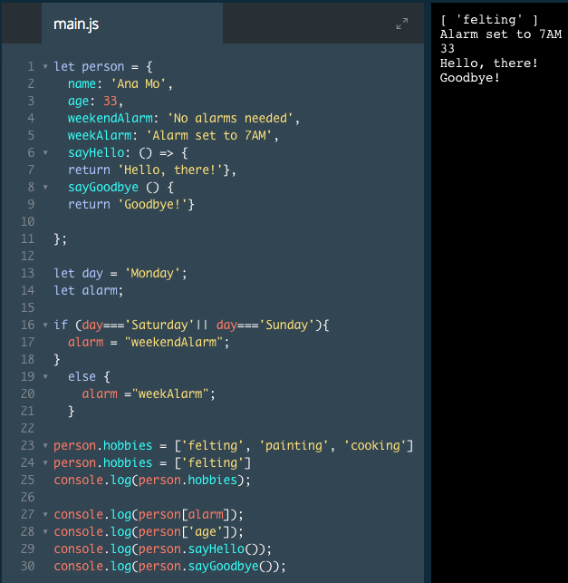

# Methods: ES6

In 2015, a new version of JavaScript (ES6) was introduced with additional methods and new syntax. One of the syntax changes impacted how you can create methods. The new version of JavaScript supports the old method syntax because many JavaScript developers still use it.

The new method syntax (see below) doesn't require arrow syntax or a colon `(:)` with the function keyword.

```js
const restaurant = {
  name: 'Italian Bistro',
  seatingCapacity: 120,
  hasDineInSpecial: true,
  entrees: ['Penne alla Bolognese', 'Chicken Cacciatore', 'Linguine pesto'],

  openRestaurant() {
    return 'Unlock the door, flip the open sign. We are open for business!';
  },
  closeRestaurant() {
    return 'Lock the door, flip the open sign. We are closed.'
  }
  ```
In the example above we change the syntax for the `.openRestaurant()` and `.closeRestaurant()` methods. This syntax, which only requires the name of the method and parentheses, is best practice for defining methods.

### Example

`sayHello` and `sayGoodbye` keys have different syntax



