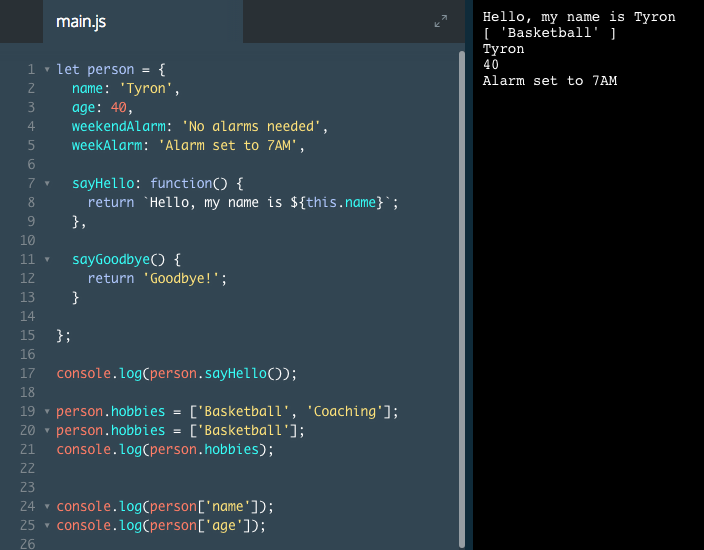
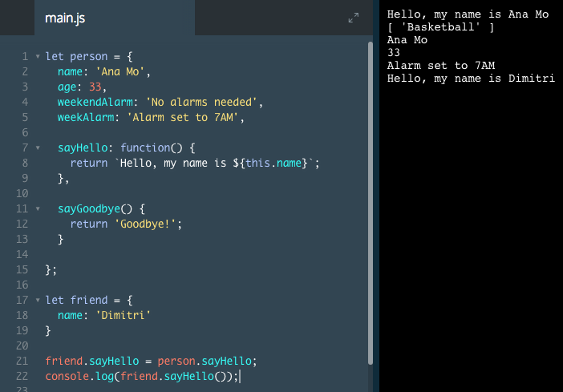

# The this Keyword I

Objects hold data and functions, which we can use to represent real-world things in JavaScript.

The next step is to create methods that operate on the data inside of the same object.

Let's try it by using the `hasDineInSpecial` property in the `.openRestaurant()` method:

```js
const restaurant = {
  name: 'Italian Bistro',
  seatingCapacity: 120,
  hasDineInSpecial: true,
  entrees: ['Penne alla Bolognese', 'Chicken Cacciatore', 'Linguine pesto'],
  openRestaurant() {
    if (hasDineInSpecial) {
      return 'Unlock the door, post the special on the board, then flip the open sign.';
    } else {
      return 'Unlock the door, then flip the open sign.';
    }
  }
};

console.log(restaurant.openRestaurant());
```
The output would be:

`ReferenceError: hasDineInSpecial is not defined`

The error above doesn't work because `hasDineInSpecial` is out of the `.openRestaurant()` method's scope.

To address this scope issue, we can use the this keyword to access properties inside of the same object.

We can utilize this in the `.openRestaurant()` function as such:

```js
const restaurant = {
  name: 'Italian Bistro',
  seatingCapacity: 120,
  hasDineInSpecial: true,
  entrees: ['Penne alla Bolognese', 'Chicken Cacciatore', 'Linguine pesto'],
  openRestaurant: function() {
    if (this.hasDineInSpecial) {
      return 'Unlock the door, post the special on the board, then flip the open sign.'
    } else {
      return 'Unlock the door, then flip the open sign.'
    }
  }
}

console.log(restaurant.openRestaurant());
```
The output would be:

`Unlock the door, post the special on the board, then flip the open sign.`

The `.openRestaurant()` method in the example above will return a value. The this keyword refers to the current object, which we use to grab the value saved to `hasDineInSpecial`.

`this.hasDineInSpecial` inside the object is the same as accessing `restaurant.hasDineInSpecial` outside the object.

### Example



# The this Keyword II

In Javascript, this refers to the object we call it inside.

For instance, if we have:

```js
let myObj = {
  name: 'Miti',
  sayHello() {
    return `${this.name} says hello!`;
  }
};
```
If we call `myObj.sayHello()`, our method will return `'Miti says hello!'`. this in the example above is called inside the `myObj` object, which limits the scope to the properties inside of `myObj`.

Let's change that by switching the object calling this:

```js
let yourObj = {
  name: 'Timer'
};

yourObj.sayHello = myObj.sayHello;
// Sets the sayHello method on yourObj to be the sayHello method on yourObj
```

If you call `yourObj.sayHello()`, it will return `'Timer says hello!'`. this in the example above is called inside the `yourObj` object, which limits the scope to the properties inside of `yourObj`.

### Example

It logged your friend's name instead of yours because the meaning of this changed to the friend object, for which the name key is different.



