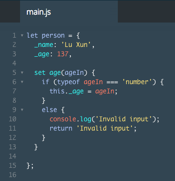
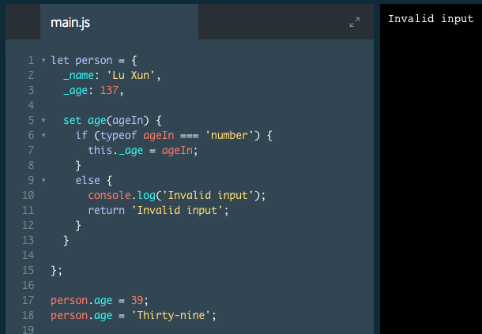
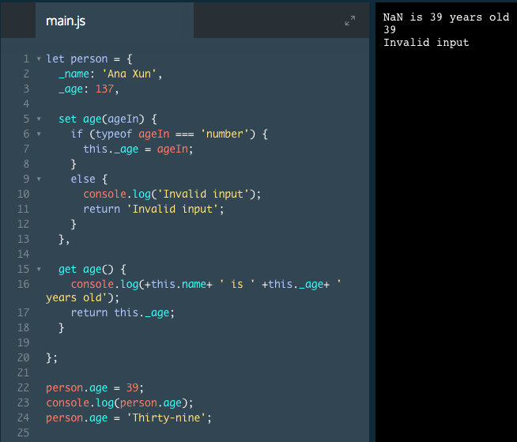

# Getters and Setters I

A common object design paradigm is to include *getter* and *setter* methods as attributes.

Getter and setter methods get and set the properties inside of an object. There are a couple of advantages to using these methods for getting and setting properties directly:

* You can check if new data is valid before setting a property.
* You can perform an action on the data while you are getting or setting a property.
* You can control which properties can be set and retrieved.

Let's consider our `restaurant` object from earlier:

```js
let restaurant = {
  name: 'Italian Bistro',
  seatingCapacity: 120,
  hasDineInSpecial: true,
  entrees: ['Penne alla Bolognese', 'Chicken Cacciatore', 'Linguine Pesto']
}
```
In the example above, the `seatingCapacity` key holds the number `120`. Let's imagine that the restaurant managers like that this value is a number because they can use it to calculate the number of available seats at any given time during the evening.

`Available seats = Capacity - Seats Taken`

Imagine the restaurant adds an extra room to increase the seating capacity by thirty people and the managers must change the `seatingCapacity` value in the restaurant object.

A good developer would anticipate `seatingCapacity` as something that could change. To address this change, they would write code that checks if the newly set `seatingCapacity` value is valid. For example, the method should check if the `seatingCapacity` field is a number like `150`, not the string `'one hundred fifty'`. We can write this into a setter method as follows:

```js
let restaurant = {
  _name: 'Italian Bistro',
  _seatingCapacity: 120,
  _hasDineInSpecial: true,
  _entrees: ['Penne alla Bolognese', 'Chicken Cacciatore', 'Linguine pesto'],

  set seatingCapacity(newCapacity) {
      if (typeof newCapacity === 'number') {
        this._seatingCapacity = newCapacity;
      console.log(`${newCapacity} is valid input.`);
    } else {
        console.log(`Change ${newCapacity} to a number.`)
    }
  }
}
```
Let's consider the new information in this example step-by-step.

* We prepended the property names with underscores `(_)`. Developers use an underscore before a property name to indicate a property or value should not be modified directly by other code. We recommend prepending all properties with an underscore, and creating setters for all attributes you want to access later in your code.
* The `set seatingCapacity()` setter method accepts `newCapacity` as a variable. The `newCapacity` variable holds the new value that we will store in `_seatingCapacity`.
* Inside of the `.seatingCapacity()` setter we use a conditional statement to check if the `newCapacity` variable (our new value) is a number.
* If the input value is a number (valid input), then we use `this._seatingCapacity` to change the value assigned to `_seatingCapacity`. If it is not valid, then we output a message to the user.

### Example



# Getters and Setters II

Now that you know how to create a setter method, you may be wondering how we use it. We call setter methods the same way we edited properties. The example below contains the same object as the last exercise.

```js
let restaurant = {
  _name: 'Italian Bistro',
  _seatingCapacity: 120,
  _hasDineInSpecial: true,
  _entrees: ['Penne alla Bolognese', 'Chicken Cacciatore', 'Linguine pesto'],

  set seatingCapacity(newCapacity) {
      if (typeof newCapacity === 'number') {
        this._seatingCapacity = newCapacity;
      console.log(`${newCapacity} is valid input.`);
    } else {
        console.log(`Change ${newCapacity} to a number.`);
    }
}
```
The code below calls the setter method:

```js
// Sets the _seatingCapacity value to 150
restaurant.seatingCapacity = 150;
```
The output would be:

`150 is valid input.`

In the example above, we set the `_seatingCapacity` value to `150`. We use the same syntax we would use to set a property that doesn't have a setter method. Since the input (150) is a number, our method will execute the first block in the conditional statement — it changes `_seatingCapacity` to `150` and logs `150 is a valid input.` to the console.

### Example



# Getters and Setters III

Once you've set the properties, you need a way to access them. Getters are used to get the property values inside of an object.

```js
let restaurant = {
  _name: 'Italian Bistro',
  _seatingCapacity: 120,
  _hasDineInSpecial: true,
  _entrees: ['Penne alla Bolognese', 'Chicken Cacciatore', 'Linguine pesto'],

  set seatingCapacity(newCapacity) {
    if (typeof newCapacity === 'number') {
      this._seatingCapacity = newCapacity;
    } else {
      console.log(`Change ${newCapacity} to a number.`)
    }
  },

  get seatingCapacity() {
    console.log(`There are ${this._seatingCapacity} seats at Italian Bistro.`);
    return this._seatingCapacity;
  }
}
```
In the example above, the getter method `(get seatingCapacity())` logs something to the console and returns the value saved to `_seatingCapacity.` We call the getter method the same way we would access a property without a method:

```js
restaurant.seatingCapacity = 150;
const seats = restaurant.seatingCapacity;
```
In this example we set the `seatingCapacity` to `150`, then call the getter method using `restaurant.seatingCapacity` and save the result to a variable called seats. The getter will also log the following line of code to the console:

`There are 150 seats at Italian Bistro.`

### Example


