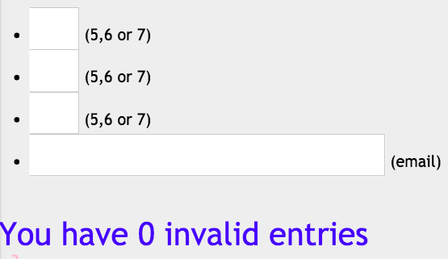
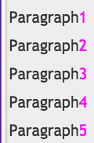

# Review

### Example 1
```css
body {counter-reset: invalidCount;}
:invalid {
  background-color: pink;
  counter-increment: invalidCount;
}
p:before {
  content: "You have " 
      counter(invalidCount) " invalid entries";
}
```


### Example 2

```css
body { counter-reset: pagecount; }
p { 
	counter-increment: pagecount;
}
p:after { color: magenta;
  content: "" counter(pagecount);
}
```


