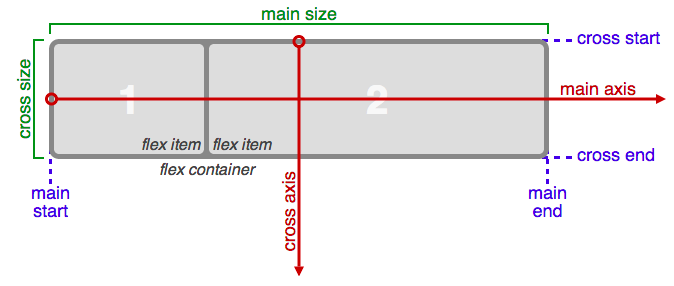
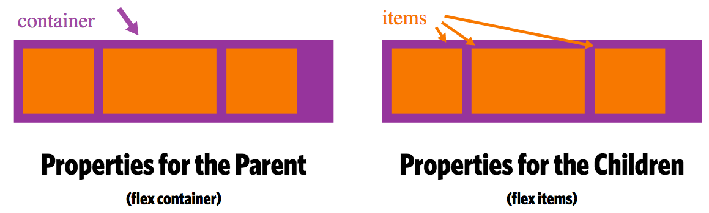

# Basics and Terminology

Flexbox is a CSS layout mode which makes it easier to create responsive websites. It allows us to effortlessly manipulate the child elements (also called flex items) of a flex container. For example, you can:

* Reorder the flex items.
* Easily place items in a row beside each other and then by adjusting the browser window, the space between them will also adjust.
* Make those items wrap to the next line (inside the container) when screen gets smaller etc.

If regular layout is based on both block and inline flow directions, the flex layout is based on "flex-flow directions". Please have a look at this figure from the specification, explaining the main idea behind the flex layout.

Basically, items will be laid out following either the `main axis` (from `main-start` to `main-end`) or the `cross axis` (from `cross-start` to `cross-end`).

* **main axis** - The main axis of a flex container is the primary axis along which flex items are laid out. Beware, it is not necessarily horizontal; it depends on the flex-direction property (see below).
* **main-start | main-end** - The flex items are placed within the container starting from main-start and going to main-end.
* **main size** - A flex item's width or height, whichever is in the main dimension, is the item's main size. The flex item's main size property is either the ‘width’ or ‘height’ property, whichever is in the main dimension.
* **cross axis** - The axis perpendicular to the main axis is called the cross axis. Its direction depends on the main axis direction.
* **cross-start | cross-end** - Flex lines are filled with items and placed into the container starting on the cross-start side of the flex container and going toward the cross-end side.
* **cross size** - The width or height of a flex item, whichever is in the cross dimension, is the item's cross size. The cross size property is whichever of ‘width’ or ‘height’ that is in the cross dimension.

