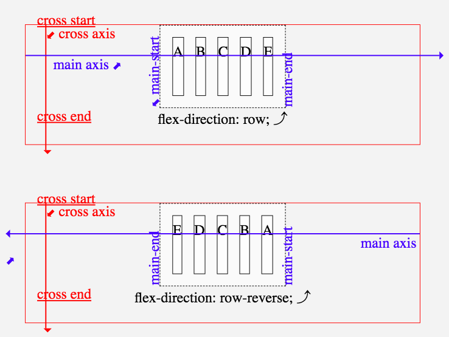
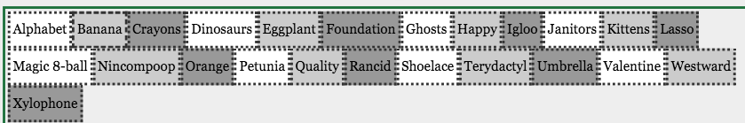

## Flex direction property

* row
* row-reverse
* column
* column-reverse

## main-axis



The power of flex box is - when you cange language the axis changes (e.g. from left-to-right to right-to-left / from top-to-bottom to bottom-to-top). 

## Flex-wrap property 

* nowrap (default)
* wrap
* wrap-reverse

Purpose: is the whole shebang on one line, or can it wrap if necessary?

### Example



```css
body > div {
  display: flex;
  flex-direction: row;
  flex-wrap: wrap;
}
div >  div {
  flex: 10%;
  min-width: 0;
}
```
## Flex-flow property

Shorthand for flex-direction and flex-wrap


