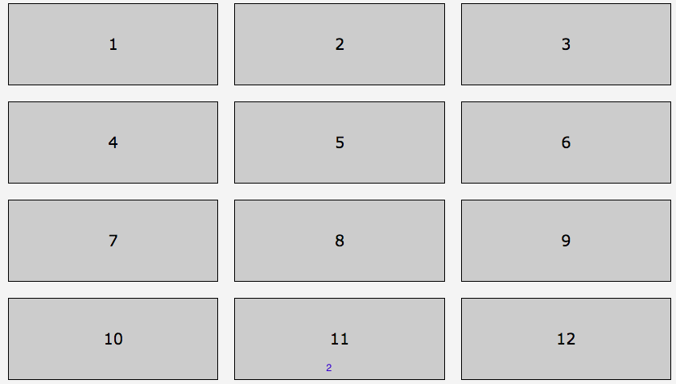
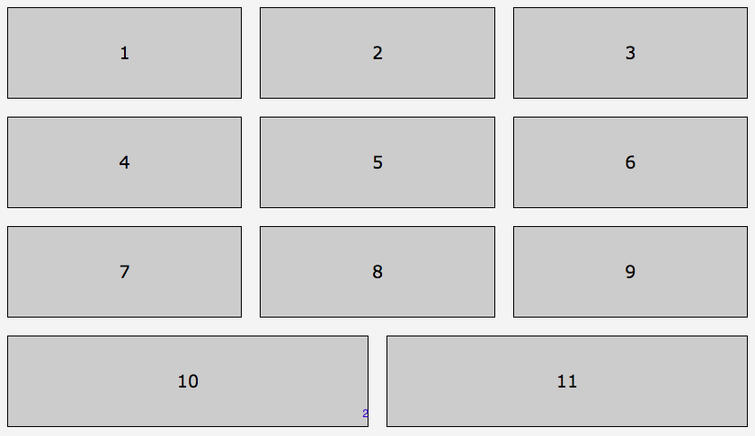
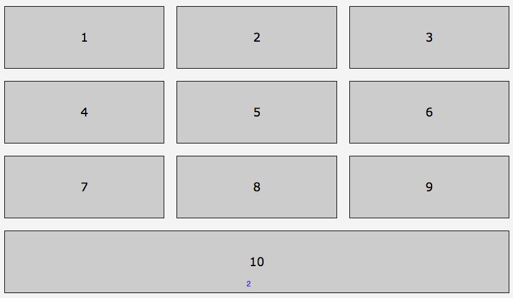
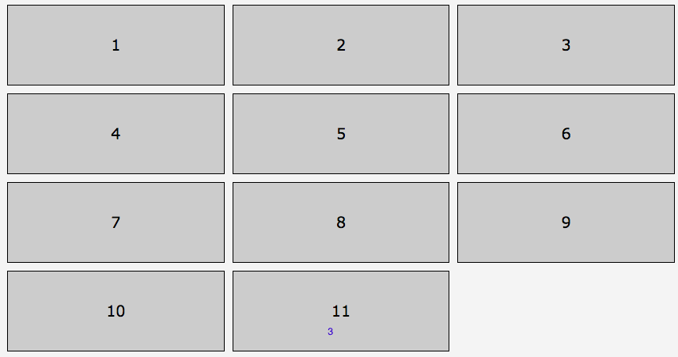
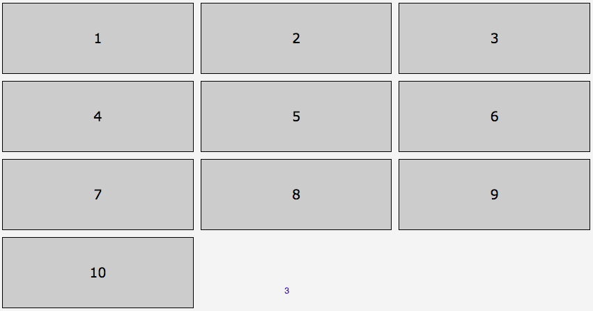
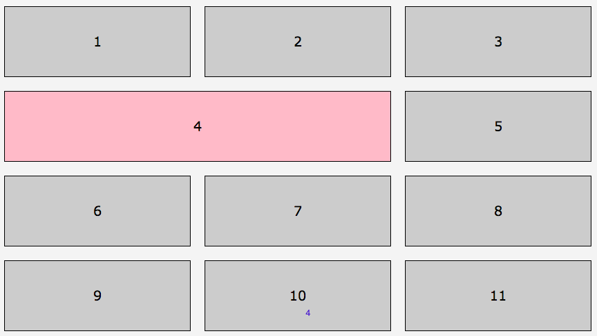
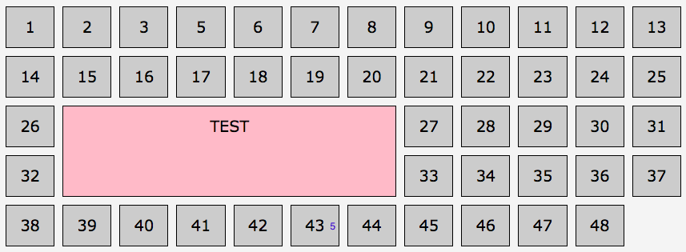

## Flexbox

When you want ot do basically a two-dimentional layout, when you just add an element and it just goes across the line. 

E.g this looks like a grid, but made with flexbox. 

```css
ol { display: flex; flex-flow: row wrap; }
li { flex: 1 1 250px; margin: 10px;}
li:last-of-type { display: x; } /*change to none */
```



If we want to get rid of 1 cell, we can use `none`, but it won't look nice.

```css
ol { display: flex; flex-flow: row wrap; }
li { flex: 1 1 250px; margin: 10px;}
li:last-of-type { display: none; } 
```



OR

```css
ol { display: flex; flex-flow: row wrap; }
li { flex: 1 1 250px; margin: 10px;}
li:last-of-type, li:nth-of-type(11) { display: none; } 
```




## Grid

Grid allows us to get rid of the last item in the list. 

```css
ol { 
  display: grid;
  grid-template-columns: repeat(3, 1fr);
  grid-gap: 10px;}
li:last-of-type { display: none; } /*change to none */
```



AND

```css
ol { 
  display: grid;
  grid-template-columns: repeat(3, 1fr);
  grid-gap: 10px;}
li:last-of-type, li:nth-of-type(11) { display: none; }
```



### Some orther things the Grid can do 

We can combine cells different way 

```css
ol {  display: grid; grid-template-columns: repeat(3, 1fr); grid-gap: 20px;}
li:nth-of-type(4) { grid-column: auto / span 2; background-color: pink; } 
```



OR 

```css
ol { 
  grid-template-columns: repeat(12, 1fr);
}
.test {
  grid-column: 2 / 8;
  grid-row: 3 / 5;  /*change values */
}
```




