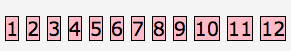
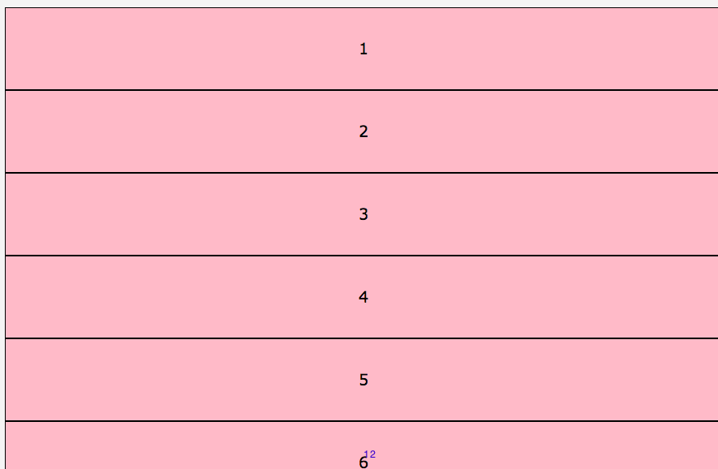
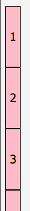
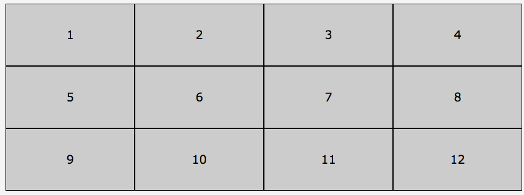

# Display Property

**display:** inline | block | list-item | inline-list-item | inline-block | flex | inline-flex| **grid** | **inline-grid** | table | inline-table | table-row-group | table-header-group | table-footer-group | table-row | table-cell | table-column-group | table-column | table-caption | ruby | ruby-base | ruby-text | ruby-base-container | ruby-text-container | contents | none | flow | flow-root

Here we have 12 spans called them to be pink

```css
span {
  background-color: pink;
}
```


If we use `display:grid`, we'll have 

```css
div{ display:grid;}
span {
  background-color: pink;
}
```



Each from 1 to 12 became a grid item. 

With `inline-grid`, we'll have

```css
div { 
  display: inline-grid;
}
span {
  background-color: pink;
}
```


To make it look nice

```css
ol { 
  display: grid;
  grid-template-columns: repeat(4, 1fr);
  list-style-type: none;
}
```



