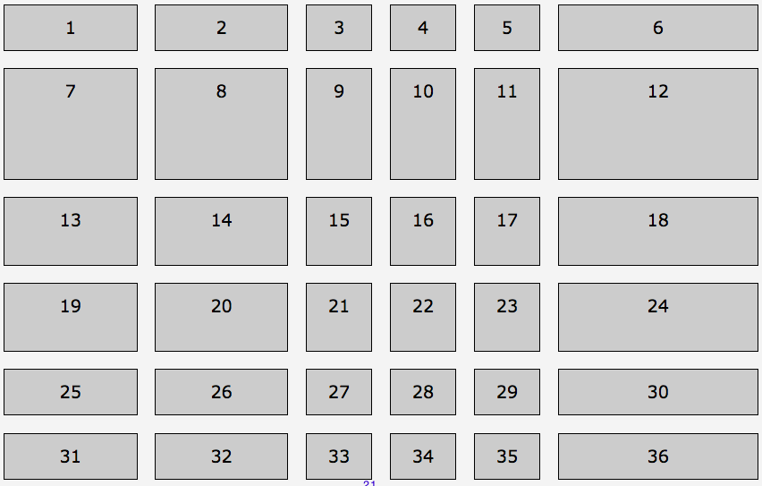

# Adding Gutters

Gutter size: global spacing between grid items with:

* **grid-column-gap** - vertical space between columns 
* **grid-row-gap** - horizontal space between rows
* **grid-gap** - shorthand for grid-row-gap and grid-column-gap, in that order. Can take one or two length or percents. 

Only a single size for each axis.

    ```
    grid-column-gap: 20px;
    grid-row-gap: 1em;
    grid-gap: 1em 20px;
    ```
Margin works! Feature or bug?

```css
ol { 
  grid-template-columns: repeat(2, 2fr) repeat(3, 1fr) 3fr;
  grid-template-rows: 2fr 125px repeat(2, 4em);
  grid-row-gap: 10px;
  grid-column-gap: 20px;
  grid-gap: 20px;
  grid-gap: 1em;
}
```



